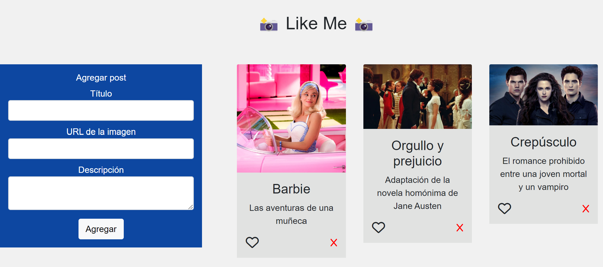
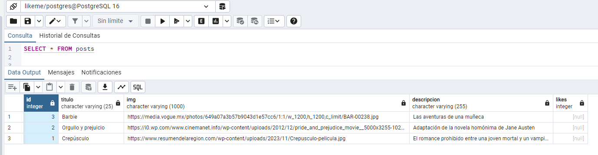
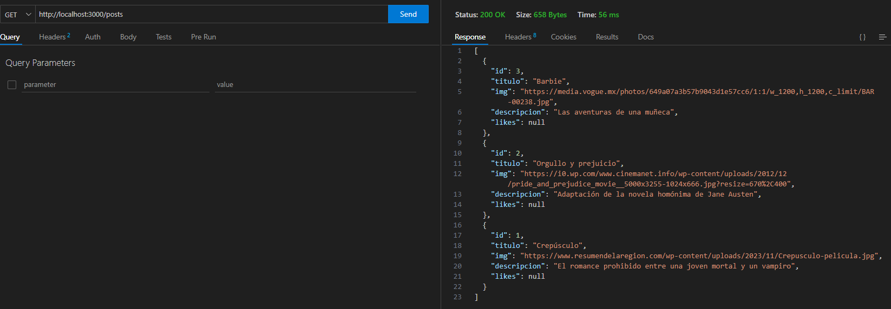

<h1 align="left"> Like Me - Parte 1 - Node </h1>

<h3 align="left">
Para ejecutar scripts de node desde la terminal, se ejecutar "npm i", luego "npm run dev" o "npm run start".
</h4>

```node
npm i

npm run dev
npm run start
```



